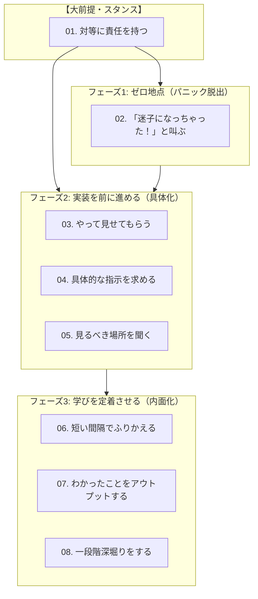

# 学習者のためのペアプログラミング・パターン

> 知識差のあるペアプロで、「先生と生徒」から脱して対等に成長するためのパターン・ランゲージ

---

## 背景と目的

熟練者と学習者など、知識やスキルの差が大きいペアでプログラミングを行う際、学習者はつい「教えてもらう側（生徒）」という受け身の姿勢に陥ってしまいがちです。

- パートナーの速いペースについていけず、頭が真っ白になって固まってしまう
- 抽象的な指示が理解できず、どう質問していいかも分からなくなる
- その場はスムーズに終わったのに、翌日になると何も覚えていない

このリポジトリは、学習者が受け身の姿勢から脱却し、**自らの手で学びの主導権を握り、対等なペアプログラマとして成果と成長を両立させるための行動パターン**をまとめたものです。

---

## 全体マップ

パターンは、大前提となるスタンスと、ペアプロの進行に応じた3つのフェーズで構成されています。

---

## パターン一覧

### 【大前提・スタンス】
- **[01. 対等に責任を持つ](./patterns/01_対等に責任を持つ.md)**  
  *知識差があっても、仕事と自己の学びに対して対等な責任を持つ。*

### フェーズ1: ゼロ地点（パニック脱出）
- **[02. 「迷子になっちゃった！」と叫ぶ](./patterns/02_迷子になっちゃったと叫ぶ.md)**  
  *頭が真っ白になったら、遠慮せず「いま何もわからない」と声に出す。*

### フェーズ2: 実装を前に進める（具体化）
- **[03. やって見せてもらう](./patterns/03_やって見せてもらう.md)**  
  *言葉で理解できないときは、まずパートナーに実演してもらい見取り稽古する。*
- **[04. 具体的な指示を求める](./patterns/04_具体的な指示を求める.md)**  
  *抽象的なナビゲーションで固まったら、具体的な「次の一手」を聞く。*
- **[05. 見るべき場所を聞く](./patterns/05_見るべき場所を聞く.md)**  
  *膨大な情報から当て推量するのではなく、熟練者がどこを見ているのか「視線と着眼点」を聞く。*

### フェーズ3: 学びを定着させる（内面化）
- **[06. 短い間隔でふりかえる](./patterns/06_短い間隔でふりかえる.md)**  
  *ワーキングメモリが溢れ出す前に、小刻みに立ち止まって頭を整理する。*
- **[07. わかったことをアウトプットする](./patterns/07_わかったことをアウトプットする.md)**  
  *「分かったつもり」を放置せず、自分の手と口でアウトプットして理解の輪郭を確かめる。*
- **[08. 一段階深堀りをする](./patterns/08_一段階深堀りをする.md)**  
  *動いたことで満足せず、「なぜ動いたのか」を一歩だけ深く問う。*

---

## パターンの読み方・使い方

1. **まず [01. 対等に責任を持つ](./patterns/01_対等に責任を持つ.md) を読む**:  
   ペアプロに臨む際のマインドセット（学習者としてのオーナーシップ）を合わせます。
2. **困った瞬間に開く**:  
   - 頭が真っ白になったら → **[02. 「迷子になっちゃった！」と叫ぶ](./patterns/02_迷子になっちゃったと叫ぶ.md)**
   - 何から手を付ければいいか分からないとき → **[03. やって見せてもらう](./patterns/03_やって見せてもらう.md)** や **[04. 具体的な指示を求める](./patterns/04_具体的な指示を求める.md)**
   - エラー画面に圧倒されたら → **[05. 見るべき場所を聞く](./patterns/05_見るべき場所を聞く.md)**
3. **作業の合間・終了時に振り返る**:  
   - ポモドーロの休憩時間や終業時に、フェーズ3のパターンを使って学びを確実に身体知へと定着させます。
